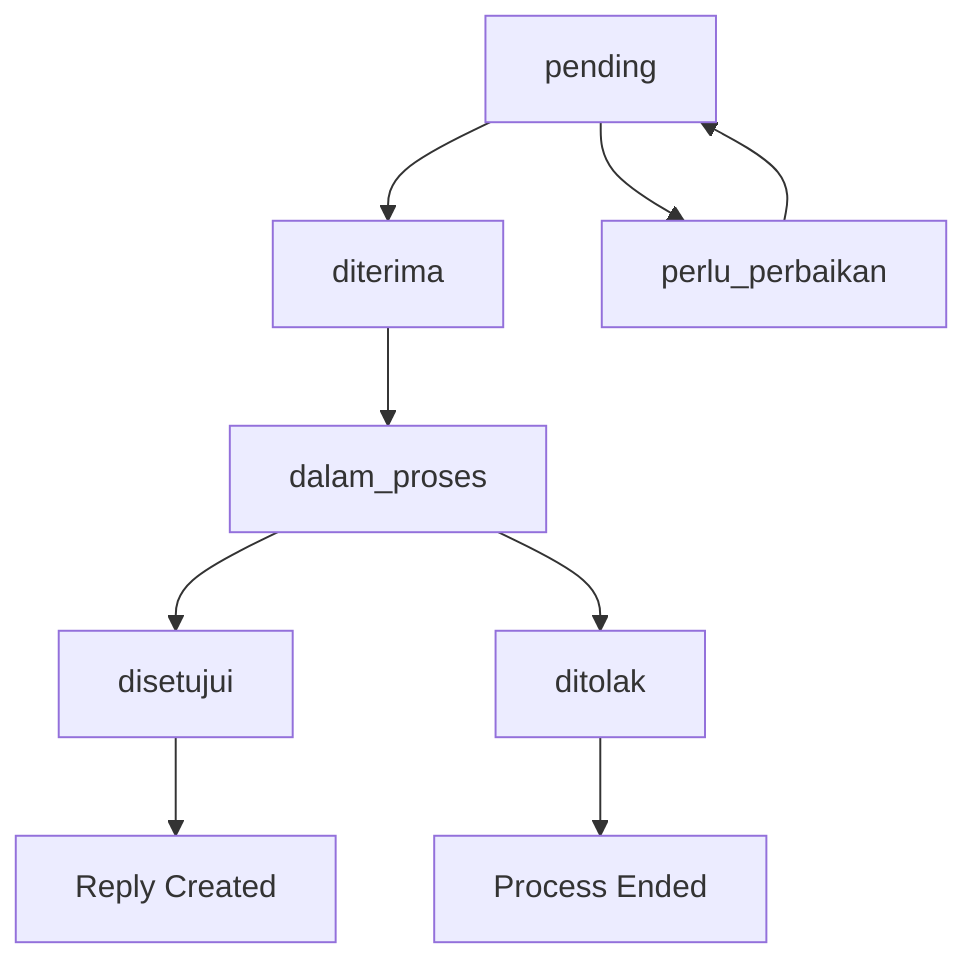

# Tata Usaha Surat Menyurat - Telkom Schools

A Laravel-based correspondence management system for Telkom Schools administration staff to handle incoming and outgoing letters efficiently.

## 🏫 Project Overview

This system is designed for Telkom Schools administrative staff to manage correspondence workflow including:
- **Incoming Letters**: Public correspondence submissions with automated routing
- **Outgoing Letters**: Internal replies and official school correspondence  
- **Status Tracking**: Multi-stage approval workflow (pending → received → in process → approved/rejected)
- **Division Management**: Letters routed to specific school divisions (academic, student affairs, finance, etc.)
- **File Attachments**: Upload and download document attachments
- **Dashboard Analytics**: Statistics and recent activity overview

## 🛠️ Technology Stack

- **Backend**: Laravel 12 (PHP 8.3+)
- **Frontend**: Livewire, Alpine.js, Tailwind CSS 4.x
- **Database**: MySQL
- **Authentication**: Laravel Fortify
- **UI Components**: Livewire Flux
- **Charts**: Chart.js
- **File Storage**: Laravel Storage (public disk)

## 📋 System Requirements

- PHP 8.3 or higher
- Composer
- Node.js & npm
- MySQL/MariaDB
- Web server (Apache/Nginx) or use Laravel's built-in server

## 🚀 Installation & Setup

### 1. Clone Repository
```bash
git clone https://github.com/kamiliarder/Tata-Usaha-Surat-Menyurat.git
cd Tata-Usaha-Surat-Menyurat
```

### 2. Install Dependencies
```bash
# Install PHP dependencies
composer install

# Install Node.js dependencies
npm install
```

### 3. Environment Configuration
```bash
# Copy environment file
cp .env.example .env

# Generate application key
php artisan key:generate

# Configure your database in .env file
```

**Required .env configuration:**
```env
APP_NAME="Tata Usaha Surat Menyurat"
APP_URL=http://localhost:8000
APP_LOCALE=id

DB_CONNECTION=mysql
DB_HOST=127.0.0.1
DB_PORT=3306
DB_DATABASE=tata_usaha_surat
DB_USERNAME=your_username
DB_PASSWORD=your_password

FILESYSTEM_DISK=public
```

### 4. Database Setup
```bash
# Create database (make sure MySQL is running)
mysql -u root -p -e "CREATE DATABASE tata_usaha_surat;"

# Run migrations
php artisan migrate

# Seed with test data
php artisan db:seed
```

### 5. Storage Setup
```bash
# Create symbolic link for file storage
php artisan storage:link
```

### 6. Build Frontend Assets
```bash
# For development
npm run dev

# For production
npm run build
```

### 7. Start Development Server
```bash
php artisan serve --port=8000
```

Visit: `http://localhost:8000`

## 👥 Test Accounts

The system comes with pre-configured test accounts for different roles:

| Role | Name | Email | Division | Purpose |
|------|------|-------|----------|---------|
| **Administrator** | Administrator | admin@sekolah.id | umum | Full system access |
| **Academic Staff** | Guru Akademik | akademik@sekolah.id | akademik | Academic letters |
| **Student Affairs** | Guru Kesiswaan | kesiswaan@sekolah.id | kesiswaan | Student-related letters |
| **Finance Staff** | Guru Keuangan | keuangan@sekolah.id | keuangan | Financial correspondence |
| **Infrastructure** | Guru Sarana Prasarana | sarpras@sekolah.id | sarpras | Facility management |
| **Non-Academic** | Guru Non Akademik | nonakademik@sekolah.id | non_akademik | Non-academic affairs |
| **General Staff** | Guru Umum | umum@sekolah.id | umum | General administration |

**Default Password**: `password` (for all accounts)

**Note**: The `visitor@dummy.local` account is used internally for external correspondence routing.

## 🏗️ System Architecture

### Key Components

1. **Public Interface** (`/pesan/create`)
   - External parties submit correspondence
   - Dynamic dropdown for staff selection by division
   - File upload capability
   - Automatic status assignment to "pending"

2. **Admin Dashboard** (`/admin/pesan`)
   - View all correspondence with filtering
   - Status management with modal interface
   - Detailed letter view with attachments
   - Conditional deletion (only rejected/needs-revision)

3. **Staff Dashboard** (`/dashboard`)
   - Statistics overview with charts
   - Recent letters assigned to logged-in user
   - Quick status overview

### Database Schema

- **tb_pesan**: Main letters table with status tracking
- **tb_pengguna**: Users/staff with division assignments  
- **tb_lampiran**: File attachments linked to letters

### Status Workflow

```
Public Submission → pending → diterima → dalam_proses → [disetujui | ditolak | perlu_perbaikan]
```

## 🔧 Development Guide

### Project Structure
```
app/
├── Http/Controllers/
│   ├── AdminPesanController.php    # Admin letter management
│   ├── PublicPesanController.php   # Public submission
│   └── DashboardController.php     # Dashboard statistics
├── Models/
│   ├── Pesan.php                   # Letter model
│   ├── User.php                    # User model  
│   └── Lampiran.php               # Attachment model
└── Livewire/                      # Livewire components

resources/views/
├── admin/pesan/index.blade.php    # Letter management interface
├── dashboard.blade.php            # Main dashboard
├── components/                    # Reusable UI components
└── livewire/                     # Livewire views
```

### Key Routes
- `GET /` - Welcome page
- `GET /pesan/create` - Public letter submission
- `GET /dashboard` - Staff dashboard (auth required)
- `GET /admin/pesan` - Letter management (auth required)
- `GET|PATCH|DELETE /admin/pesan/{id}` - Letter CRUD operations

### API Endpoints
- `GET /api/pengguna/by-divisi/{divisi}` - Get staff by division

## 📱 Features

### ✅ Implemented Features
- [x] Public letter submission with file upload
- [x] Dynamic staff dropdown by division
- [x] Admin letter management interface
- [x] Status tracking and updates
- [x] File attachment handling
- [x] Dashboard with statistics
- [x] User authentication
- [x] Responsive design
- [x] AJAX-powered modals
- [x] Conditional letter deletion

### 🚧 Planned Features
- [ ] Email notifications for status changes
- [x] Advanced search and filtering
- [x] Letter templates
- [ ] Bulk operations
- [ ] Audit trail
- [ ] Reports and analytics
- [ ] Mobile app integration

## 🐛 Common Issues & Solutions

### Issue 1: "Gagal memuat surat" when viewing details
**Solution**: Ensure you're logged in and the AJAX request headers are properly set.

### Issue 2: Status update shows error but actually works
**Solution**: Clear browser cache and ensure CSRF tokens are valid.

### Issue 3: File uploads not working
**Solution**: 
```bash
php artisan storage:link
chmod -R 775 storage/
```

### Issue 4: Database connection errors
**Solution**: Check `.env` database configuration and ensure MySQL is running.

## 🔒 Security Considerations

- All admin routes require authentication
- CSRF protection on forms
- File upload validation (type and size limits)
- SQL injection protection via Eloquent ORM
- XSS protection via Blade templating

## 🤝 Contributing

1. Fork the repository
2. Create a feature branch (`git checkout -b feature/amazing-feature`)
3. Commit your changes (`git commit -m 'Add amazing feature'`)
4. Push to the branch (`git push origin feature/amazing-feature`)
5. Open a Pull Request

## 📞 Support

For technical issues or questions:
- Check the issues section on GitHub
- Contact the development team
- Review Laravel documentation for framework-specific questions

## 📄 License

This project is open-sourced software licensed under the [MIT license](https://opensource.org/licenses/MIT).

## 💌 Special Thanks to
- Arman D. (Requirement Analyst)
- Muhammad Husain H. (Quality Assurance)
- Meraz E.H. (Frontend, UI/UX)
- Betarus M.B. (Frontend, UI/UX)
- Copilot (Backend & Frontend Assist)
---


# Complete System Flow Documentation - Tata Usaha Surat Menyurat

## Table of Contents
1. [System Overview](#system-overview)
2. [Complete User Journey](#complete-user-journey)
3. [Backend Process Flow](#backend-process-flow)
4. [Database Operations](#database-operations)
5. [File Management](#file-management)
6. [Status Workflow](#status-workflow)
7. [Security & Validation](#security--validation)
8. [Technical Implementation Details](#technical-implementation-details)

---

## System Overview

The **Tata Usaha Surat Menyurat System** is a complete correspondence management solution that handles the entire lifecycle of letters/documents from public submission to administrative response.

### Key Participants
- **Public Users**: External individuals/organizations submitting correspondence
- **Admin Staff**: Internal staff managing and processing correspondence
- **System**: Backend processes handling data, files, and workflows

### Core Process Flow
```
Public Submission → Admin Review → Processing → Status Updates → Reply Generation
```

---

## Complete User Journey

### Phase 1: Public Letter Submission

#### 1.1 User Accesses Submission Form
**Frontend Flow:**
```
1. User visits homepage (/)
2. Clicks "Kirim Surat" or navigates to /pesan/create
3. Route: GET /pesan/create → PublicPesanController@create
```

**Backend Process:**
```php
// PublicPesanController@create()
public function create() {
    // Fetch all staff members except dummy account
    $staffMembers = User::where('email', '!=', 'visitor@dummy.local')
        ->orderBy('divisi')
        ->orderBy('nama')
        ->get()
        ->groupBy('divisi');
    
    return view('public.pesan.create', compact('staffMembers'));
}
```

**Database Query:**
```sql
SELECT * FROM tb_pengguna 
WHERE email != 'visitor@dummy.local' 
ORDER BY divisi, nama;
```

#### 1.2 Dynamic Recipient Loading
**Frontend:** User selects category → AJAX request triggered

**Backend Process:**
```php
// Route: GET /api/pengguna/by-divisi/{divisi}
public function getStaffByDivisi($divisi) {
    $query = User::where('email', '!=', 'visitor@dummy.local');
    
    if ($divisi && $divisi !== 'umum') {
        $query->where('divisi', $divisi);
    }
    
    $staffMembers = $query->orderBy('nama')->get(['id_pengguna', 'nama', 'divisi']);
    
    return response()->json($staffMembers);
}
```

#### 1.3 Form Submission
**Frontend:** User fills form → submits → POST /pesan/store

**Backend Validation:**
```php
$validated = $request->validate([
    'judul' => 'required|string|max:200',
    'perihal' => 'nullable|string',
    'kategori' => 'required|in:akademik,kesiswaan,keuangan,umum,non_akademik,sarpras',
    'id_penerima' => 'required|exists:tb_pengguna,id_pengguna',
    'pengirim' => 'required|string|max:200',
    'instansi' => 'nullable|string|max:50',
    'kontak_pengirim' => 'required|string|max:100',
    'alamat_pengirim' => 'nullable|string|max:255',
    'lampiran.*' => 'nullable|file|max:10240|mimes:pdf,doc,docx,jpg,jpeg,png,gif',
]);
```

**Security Check:**
```php
// Prevent selection of dummy visitor account
$dummyAccountId = User::where('email', 'visitor@dummy.local')->first()->id_pengguna;
if ($validated['id_penerima'] == $dummyAccountId) {
    return back()->withErrors(['id_penerima' => 'Invalid recipient selection']);
}
```

### Phase 2: Letter Creation & Storage

#### 2.1 Generate Unique Letter Number
**Algorithm:**
```php
public static function generateNomorPesan(): string {
    $year = date('Y');
    $month = date('m');
    $latest = static::whereYear('tanggal_kirim', $year)
        ->whereMonth('tanggal_kirim', $month)
        ->count();
    
    return sprintf('%s/%s/%04d', $year, $month, $latest + 1);
}
```

**Example Output:** `2025/10/0001`

#### 2.2 Create Letter Record
**Database Operation:**
```php
$pesan = Pesan::create([
    'nomor_pesan' => $nomorPesan,        // Auto-generated
    'judul' => $validated['judul'],
    'perihal' => $validated['perihal'],
    'kategori' => $validated['kategori'],
    'tipe' => 'masuk',                   // Incoming letter
    'tanggal_kirim' => now(),
    'pengirim' => $validated['pengirim'],
    'id_penerima' => $validated['id_penerima'],
    'status_pesan' => 'pending',         // Initial status
    'instansi' => $validated['instansi'],
    'kontak_pengirim' => $validated['kontak_pengirim'],
    'alamat_pengirim' => $validated['alamat_pengirim'],
]);
```

**SQL Query Generated:**
```sql
INSERT INTO tb_pesan (
    nomor_pesan, judul, perihal, kategori, tipe, 
    tanggal_kirim, pengirim, id_penerima, status_pesan,
    instansi, kontak_pengirim, alamat_pengirim
) VALUES (
    '2025/10/0001', 'Letter Title', 'Subject Matter', 'akademik', 'masuk',
    '2025-10-07 10:30:00', 'John Doe', 1, 'pending',
    'External Org', 'john@example.com', '123 Main St'
);
```

#### 2.3 File Upload Processing
**For each uploaded file:**
```php
if ($request->hasFile('lampiran')) {
    foreach ($request->file('lampiran') as $file) {
        $originalName = $file->getClientOriginalName();
        $fileName = time() . '_' . Str::random(10) . '.' . $file->getClientOriginalExtension();
        $filePath = $file->storeAs('lampiran', $fileName, 'public');
        
        Lampiran::create([
            'id_pesan' => $pesan->id_pesan,
            'nama_file' => $originalName,
            'path_file' => $filePath,
            'ukuran_file' => $file->getSize(),
            'jenis_file' => $file->getClientOriginalExtension(),
        ]);
    }
}
```

**File Storage Structure:**
```
storage/app/public/lampiran/
├── 1696680600_aBcD123456.pdf
├── 1696680601_xYz789abcd.docx
└── 1696680602_mNpQ456789.jpg
```

#### 2.4 Success Redirect
**Final Step:**
```php
return redirect()->route('public.pesan.success')
    ->with('success', 'Surat berhasil dikirim! Nomor: ' . $nomorPesan);
```

---

## Phase 3: Admin Management & Processing

### 3.1 Admin Dashboard Access
**Route:** GET /admin/pesan → AdminPesanController@index

**Backend Process:**
```php
public function index(Request $request) {
    $query = Pesan::with(['penerima', 'lampiran']);
    
    // Apply filters (search, category, status, type)
    if ($request->filled('search')) {
        $search = $request->search;
        $query->where(function($q) use ($search) {
            $q->where('judul', 'like', "%{$search}%")
              ->orWhere('pengirim', 'like', "%{$search}%")
              ->orWhere('nomor_pesan', 'like', "%{$search}%");
        });
    }
    
    // Additional filters for tipe, status, kategori
    
    $letters = $query->orderBy('tanggal_kirim', 'desc')->paginate(15);
    
    return view('admin.pesan.index', compact('letters'));
}
```

**Generated SQL:**
```sql
SELECT p.*, u.nama as penerima_nama, u.divisi,
       COUNT(l.id_lampiran) as lampiran_count
FROM tb_pesan p
LEFT JOIN tb_pengguna u ON p.id_penerima = u.id_pengguna
LEFT JOIN tb_lampiran l ON p.id_pesan = l.id_pesan
WHERE p.judul LIKE '%search_term%' 
   OR p.pengirim LIKE '%search_term%'
   OR p.nomor_pesan LIKE '%search_term%'
GROUP BY p.id_pesan
ORDER BY p.tanggal_kirim DESC
LIMIT 15 OFFSET 0;
```

### 3.2 Letter Detail View
**Trigger:** Admin clicks on letter → AJAX request

**Backend Process:**
```php
public function show($id) {
    $letter = Pesan::with('lampiran', 'penerima')->findOrFail($id);
    
    if (request()->expectsJson()) {
        return response()->json($letter);
    }
    
    return view('admin.pesan.show', compact('letter'));
}
```

**Frontend JavaScript:**
```javascript
function showDetail(letterId) {
    fetch(`/admin/pesan/${letterId}`, {
        method: 'GET',
        headers: {
            'Accept': 'application/json',
            'X-Requested-With': 'XMLHttpRequest'
        }
    })
    .then(response => response.json())
    .then(data => {
        document.getElementById('detailContent').innerHTML = generateDetailHTML(data);
        showModal('detailModal');
    });
}
```

### 3.3 Status Management
**Trigger:** Admin changes status → AJAX request

**Backend Process:**
```php
public function update(Request $request, $id) {
    $letter = Pesan::findOrFail($id);
    
    $validated = $request->validate([
        'status_pesan' => 'required|in:pending,diterima,dalam_proses,perlu_perbaikan,disetujui,ditolak'
    ]);
    
    $letter->update($validated);
    
    return response()->json(['success' => true]);
}
```

**Status Flow Logic:**
```
pending → diterima → dalam_proses → disetujui/ditolak
    ↓
perlu_perbaikan (can loop back to pending)
```

---

## Phase 4: Reply Generation

### 4.1 Create Reply Form
**Route:** GET /admin/pesan/{id}/reply → AdminPesanController@createReply

**Backend Process:**
```php
public function createReply($originalMessageId) {
    $originalPesan = Pesan::with('penerima')->findOrFail($originalMessageId);
    
    // Get dummy visitor account for outgoing messages
    $dummyAccount = User::where('email', 'visitor@dummy.local')->first();
    
    return view('admin.pesan.create-reply', compact('originalPesan', 'dummyAccount'));
}
```

### 4.2 Store Reply Letter
**Route:** POST /admin/pesan/{id}/reply → AdminPesanController@storeReply

**Backend Process:**
```php
public function storeReply(Request $request, $originalMessageId) {
    $originalPesan = Pesan::findOrFail($originalMessageId);
    
    $validated = $request->validate([
        'judul' => 'required|string|max:200',
        'perihal' => 'nullable|string',
        'pengirim' => 'required|string|max:200',
        'instansi' => 'nullable|string|max:50',
        'lampiran.*' => 'nullable|file|max:10240|mimes:pdf,doc,docx,jpg,jpeg,png,gif',
    ]);
    
    // Get dummy account for external recipient
    $dummyAccount = User::where('email', 'visitor@dummy.local')->first();
    
    // Generate new message number
    $nomorPesan = Pesan::generateNomorPesan();
    
    // Create reply message
    $replyPesan = Pesan::create([
        'nomor_pesan' => $nomorPesan,
        'judul' => $validated['judul'],
        'perihal' => $validated['perihal'],
        'kategori' => $originalPesan->kategori,  // Inherit category
        'tipe' => 'keluar',                      // Outgoing letter
        'tanggal_kirim' => now(),
        'pengirim' => $validated['pengirim'],
        'id_penerima' => $dummyAccount->id_pengguna, // Dummy for external
        'status_pesan' => 'diterima',            // Auto-approved
        'instansi' => $validated['instansi'],
        'id_pesan_terkait' => $originalMessageId, // Link to original
    ]);
    
    // Handle reply file uploads (same process as original)
    
    return redirect()->route('admin.pesan.index')
        ->with('success', 'Surat balasan berhasil dibuat! Nomor: ' . $nomorPesan);
}
```

---

## Backend Process Flow

### 1. Request Lifecycle
```
HTTP Request → Middleware → Route → Controller → Model → Database
     ↓
Response ← View ← Controller ← Model ← Database Result
```

### 2. Database Transaction Flow
**For Letter Creation:**
```sql
BEGIN;

-- 1. Insert main letter record
INSERT INTO tb_pesan (...) VALUES (...);
SET @pesan_id = LAST_INSERT_ID();

-- 2. Insert attachments (if any)
INSERT INTO tb_lampiran (id_pesan, nama_file, path_file, ukuran_file, jenis_file)
VALUES (@pesan_id, 'file1.pdf', 'lampiran/timestamp_random.pdf', 1024000, 'pdf');

-- 3. Update statistics/counters (if implemented)

COMMIT;
```

### 3. File Storage Process
```php
// 1. Validate file
$file->validate(['max:10240', 'mimes:pdf,doc,docx,jpg,jpeg,png,gif']);

// 2. Generate unique filename
$fileName = time() . '_' . Str::random(10) . '.' . $file->getClientOriginalExtension();

// 3. Store file
$filePath = $file->storeAs('lampiran', $fileName, 'public');

// 4. Save metadata to database
Lampiran::create([...]);
```

### 4. Security Validation Flow
```php
// 1. CSRF Protection (automatic in Laravel)
// 2. Input Validation
$request->validate([...]);

// 3. File Security Check
$allowedTypes = ['pdf', 'doc', 'docx', 'jpg', 'jpeg', 'png', 'gif'];
$fileType = $file->getClientOriginalExtension();
if (!in_array($fileType, $allowedTypes)) {
    throw ValidationException::withMessages(['file' => 'Invalid file type']);
}

// 4. User Authorization Check
if (!Auth::check()) {
    return redirect()->route('login');
}

// 5. Dummy Account Protection
if ($recipientId === $dummyAccountId) {
    return back()->withErrors(['recipient' => 'Invalid recipient']);
}
```

---

## Database Operations

### Primary Tables Structure

#### 1. `tb_pesan` (Letters/Messages)
```sql
CREATE TABLE tb_pesan (
    id_pesan BIGINT PRIMARY KEY AUTO_INCREMENT,
    nomor_pesan VARCHAR(50) UNIQUE NOT NULL,
    judul VARCHAR(200) NOT NULL,
    perihal TEXT,
    kategori ENUM('akademik','kesiswaan','keuangan','umum','non_akademik','sarpras'),
    tipe ENUM('masuk','keluar') NOT NULL,
    tanggal_kirim DATETIME DEFAULT CURRENT_TIMESTAMP,
    pengirim VARCHAR(200) NOT NULL,
    id_penerima INT NOT NULL,
    status_pesan ENUM('pending','diterima','dalam_proses','perlu_perbaikan','disetujui','ditolak'),
    instansi VARCHAR(50),
    kontak_pengirim VARCHAR(100),
    alamat_pengirim VARCHAR(255),
    id_pesan_terkait BIGINT,
    
    FOREIGN KEY (id_penerima) REFERENCES tb_pengguna(id_pengguna),
    FOREIGN KEY (id_pesan_terkait) REFERENCES tb_pesan(id_pesan)
);
```

#### 2. `tb_lampiran` (Attachments)
```sql
CREATE TABLE tb_lampiran (
    id_lampiran BIGINT PRIMARY KEY AUTO_INCREMENT,
    id_pesan BIGINT NOT NULL,
    nama_file VARCHAR(255) NOT NULL,
    path_file VARCHAR(500) NOT NULL,
    ukuran_file BIGINT,
    jenis_file VARCHAR(10),
    
    FOREIGN KEY (id_pesan) REFERENCES tb_pesan(id_pesan) ON DELETE CASCADE
);
```

#### 3. `tb_pengguna` (Users/Staff)
```sql
CREATE TABLE tb_pengguna (
    id_pengguna INT PRIMARY KEY AUTO_INCREMENT,
    nama VARCHAR(255) NOT NULL,
    email VARCHAR(255) UNIQUE NOT NULL,
    password VARCHAR(255) NOT NULL,
    divisi VARCHAR(100),
    -- Laravel authentication fields
    email_verified_at TIMESTAMP NULL,
    remember_token VARCHAR(100),
    created_at TIMESTAMP,
    updated_at TIMESTAMP
);
```

### Key Database Operations

#### Letter Submission Query:
```sql
-- Check for duplicate number (race condition prevention)
SELECT COUNT(*) FROM tb_pesan 
WHERE nomor_pesan = '2025/10/0001' FOR UPDATE;

-- Insert new letter
INSERT INTO tb_pesan (nomor_pesan, judul, ...) VALUES (...);

-- Insert attachments
INSERT INTO tb_lampiran (id_pesan, nama_file, ...) VALUES (...);
```

#### Admin Dashboard Query:
```sql
-- Get letters with pagination and filters
SELECT 
    p.*,
    u.nama as penerima_nama,
    u.divisi,
    COUNT(l.id_lampiran) as attachment_count
FROM tb_pesan p
LEFT JOIN tb_pengguna u ON p.id_penerima = u.id_pengguna
LEFT JOIN tb_lampiran l ON p.id_pesan = l.id_pesan
WHERE p.status_pesan = 'pending'
GROUP BY p.id_pesan
ORDER BY p.tanggal_kirim DESC
LIMIT 15 OFFSET 0;
```

#### Status Update Query:
```sql
UPDATE tb_pesan 
SET status_pesan = 'diterima' 
WHERE id_pesan = 123 
  AND status_pesan IN ('pending', 'perlu_perbaikan');
```

---

## File Management

### Storage Architecture
```
storage/
├── app/
│   └── public/
│       └── lampiran/           # Attachment storage
│           ├── 1696680600_aBcD123456.pdf
│           ├── 1696680601_xYz789abcd.docx
│           └── 1696680602_mNpQ456789.jpg
└── framework/
    ├── cache/
    ├── sessions/
    └── views/
```

### File Naming Convention
**Pattern:** `{timestamp}_{random_string}.{extension}`

**Example Generation:**
```php
$timestamp = time();              // 1696680600
$random = Str::random(10);       // aBcD123456
$extension = $file->getClientOriginalExtension(); // pdf

$filename = "{$timestamp}_{$random}.{$extension}"; // 1696680600_aBcD123456.pdf
```

### File Security Measures
1. **Type Validation:** Only allow specific file types
2. **Size Limits:** Maximum 10MB per file
3. **Sanitization:** Remove special characters from filenames
4. **Storage Isolation:** Files stored outside web root
5. **Access Control:** Files served through authenticated routes

### File Access Flow
```php
// Download endpoint
Route::get('/admin/pesan/{id}/download/{attachmentId}', function($id, $attachmentId) {
    $attachment = Lampiran::where('id_lampiran', $attachmentId)
        ->whereHas('pesan', function($q) use ($id) {
            $q->where('id_pesan', $id);
        })
        ->firstOrFail();
    
    return Storage::download($attachment->path_file, $attachment->nama_file);
});
```

---

## Status Workflow

### Status States & Transitions



### Status Definitions

| Status | Description | Allowed Transitions | User Actions |
|--------|-------------|-------------------|--------------|
| `pending` | Initial state, awaiting review | → diterima, perlu_perbaikan | Admin can review |
| `diterima` | Letter accepted, ready for processing | → dalam_proses | Admin can start processing |
| `dalam_proses` | Currently being processed | → disetujui, ditolak | Admin working on response |
| `perlu_perbaikan` | Requires correction from sender | → pending | Sender must resubmit |
| `disetujui` | Approved, ready for reply | → Reply creation | Admin can create reply |
| `ditolak` | Rejected, process ended | → Archive | No further action |

### Status Update Business Logic
```php
public function updateStatus($letterId, $newStatus) {
    $letter = Pesan::findOrFail($letterId);
    
    // Validate transition
    $allowedTransitions = [
        'pending' => ['diterima', 'perlu_perbaikan'],
        'diterima' => ['dalam_proses'],
        'dalam_proses' => ['disetujui', 'ditolak'],
        'perlu_perbaikan' => ['pending'],
        // disetujui and ditolak are final states
    ];
    
    if (!in_array($newStatus, $allowedTransitions[$letter->status_pesan] ?? [])) {
        throw new InvalidStatusTransitionException();
    }
    
    $letter->update(['status_pesan' => $newStatus]);
    
    // Trigger additional actions based on status
    switch ($newStatus) {
        case 'disetujui':
            // Notify admin that reply can be created
            break;
        case 'ditolak':
            // Archive letter, possibly notify sender
            break;
    }
}
```

---

## Security & Validation

### Input Validation Rules
```php
// Public submission validation
'judul' => 'required|string|max:200',
'perihal' => 'nullable|string',
'kategori' => 'required|in:akademik,kesiswaan,keuangan,umum,non_akademik,sarpras',
'id_penerima' => 'required|exists:tb_pengguna,id_pengguna',
'pengirim' => 'required|string|max:200',
'instansi' => 'nullable|string|max:50',
'kontak_pengirim' => 'required|string|max:100',
'alamat_pengirim' => 'nullable|string|max:255',
'lampiran.*' => 'nullable|file|max:10240|mimes:pdf,doc,docx,jpg,jpeg,png,gif',

// Admin update validation
'status_pesan' => 'required|in:pending,diterima,dalam_proses,perlu_perbaikan,disetujui,ditolak'
```

### Authentication Flow
```php
// Public routes (no auth required)
Route::get('/', [WelcomeController::class, 'index']);
Route::post('/pesan/store', [PublicPesanController::class, 'store']);

// Protected routes (auth required)
Route::middleware(['auth'])->group(function () {
    Route::get('/dashboard', [DashboardController::class, 'index']);
    Route::resource('admin/pesan', AdminPesanController::class);
});
```

### CSRF Protection
- All forms include `@csrf` token
- AJAX requests include `X-CSRF-TOKEN` header
- Laravel automatically validates tokens

### XSS Prevention
- All user input is escaped in Blade templates: `{{ $variable }}`
- Raw HTML only allowed for trusted admin content: `{!! $trustedHtml !!}`

### SQL Injection Prevention
- All database queries use Eloquent ORM or prepared statements
- User input is automatically parameterized

---

## Technical Implementation Details

### Laravel Framework Features Used

#### 1. Eloquent ORM
```php
// Model relationships
class Pesan extends Model {
    public function lampiran() {
        return $this->hasMany(Lampiran::class, 'id_pesan');
    }
    
    public function penerima() {
        return $this->belongsTo(User::class, 'id_penerima', 'id_pengguna');
    }
}

// Query with relationships
$letters = Pesan::with(['penerima', 'lampiran'])
    ->where('status_pesan', 'pending')
    ->orderBy('tanggal_kirim', 'desc')
    ->paginate(15);
```

#### 2. File Storage
```php
// Store file
$filePath = $file->storeAs('lampiran', $fileName, 'public');

// Retrieve file
return Storage::download($filePath, $originalName);
```

#### 3. Validation
```php
$validated = $request->validate([
    'field' => 'required|string|max:200',
    'file' => 'file|max:10240|mimes:pdf,doc'
]);
```

#### 4. Route Model Binding
```php
// Automatic model resolution
Route::get('/admin/pesan/{pesan}', [AdminController::class, 'show']);

public function show(Pesan $pesan) {
    // $pesan is automatically loaded
    return view('admin.pesan.show', compact('pesan'));
}
```

### Frontend Technologies

#### 1. Blade Templating
```blade
@extends('layout')

@section('content')
    @if($letters->count() > 0)
        @foreach($letters as $letter)
            <div class="letter-item">{{ $letter->judul }}</div>
        @endforeach
    @else
        <p>No letters found</p>
    @endif
@endsection
```

#### 2. AJAX Operations
```javascript
// Status update
fetch(`/admin/pesan/${letterId}`, {
    method: 'PATCH',
    headers: {
        'Content-Type': 'application/json',
        'X-CSRF-TOKEN': document.querySelector('[name="_token"]').value
    },
    body: JSON.stringify({ status_pesan: newStatus })
})
.then(response => response.json())
.then(data => {
    if (data.success) {
        location.reload();
    }
});
```

#### 3. Dynamic UI Updates
```javascript
// Real-time status badge updates
function updateStatusBadge(letterId, newStatus) {
    const badge = document.querySelector(`[data-letter-id="${letterId}"] .status-badge`);
    badge.className = `status-badge status-${newStatus}`;
    badge.textContent = newStatus.replace('_', ' ');
}
```

### Performance Optimizations

#### 1. Database Indexing
```sql
-- Indexes for common queries
CREATE INDEX idx_pesan_status ON tb_pesan(status_pesan);
CREATE INDEX idx_pesan_tanggal ON tb_pesan(tanggal_kirim);
CREATE INDEX idx_pesan_kategori ON tb_pesan(kategori);
CREATE INDEX idx_pesan_penerima ON tb_pesan(id_penerima);
```

#### 2. Eager Loading
```php
// Prevent N+1 queries
$letters = Pesan::with(['penerima', 'lampiran'])->get();
```

#### 3. Pagination
```php
// Limit database load
$letters = $query->paginate(15);
```

#### 4. File Storage Optimization
- Files stored outside web root for security
- Unique filenames prevent conflicts
- Metadata stored in database for quick access

---

## Error Handling & Logging

### Exception Handling
```php
try {
    $pesan = Pesan::create($data);
} catch (QueryException $e) {
    Log::error('Database error during letter creation', [
        'error' => $e->getMessage(),
        'data' => $data
    ]);
    
    return back()->withErrors(['database' => 'Unable to save letter. Please try again.']);
}
```

### Validation Error Handling
```php
// Automatic validation error display
@error('judul')
    <div class="error-message">{{ $message }}</div>
@enderror
```

### File Upload Error Handling
```php
if ($file->getError() !== UPLOAD_ERR_OK) {
    return back()->withErrors(['lampiran' => 'File upload failed. Please try again.']);
}

if ($file->getSize() > 10 * 1024 * 1024) { // 10MB
    return back()->withErrors(['lampiran' => 'File size must be less than 10MB.']);
}
```

---

## Conclusion

The Tata Usaha Surat Menyurat system implements a comprehensive correspondence management workflow with the following key characteristics:

### System Strengths
1. **Complete Lifecycle Management**: From submission to reply
2. **Robust File Handling**: Secure upload and storage
3. **Status-driven Workflow**: Clear process stages
4. **User-friendly Interface**: Intuitive design for all user types
5. **Security-first Approach**: Input validation, CSRF protection, secure file storage

### Technical Excellence
1. **Laravel Best Practices**: Proper MVC separation, Eloquent usage
2. **Database Design**: Normalized structure with proper relationships
3. **Frontend Interactivity**: AJAX operations for smooth UX
4. **Scalable Architecture**: Easy to extend and modify

### Business Value
1. **Efficiency**: Streamlined correspondence processing
2. **Transparency**: Clear status tracking
3. **Accountability**: Complete audit trail
4. **User Experience**: Simple submission process for external users

This system successfully bridges the gap between public correspondence needs and internal administrative processes, providing a robust platform for educational institution communication management.

**Developed for Telkom Schools** | Last Updated: October 2025
